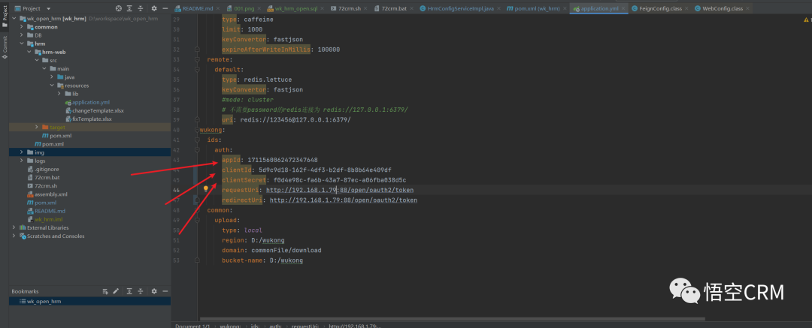

# Wukong_Accounting

体验地址：[https://www.72crm.com](http://www.72crm.com)

## 悟空财务系统介绍

悟空财务系统可满足不同角色的跨级人员能处理日常业务，通过系统编制收款、付款、转账凭证、期末记账与结账等，自动形成总分类账、明细账和财务报表，自动进行财务分析，提高企业财务核酸效率的同时，又能够反映业务运营状况。

官网地址：[http://www.5kcrm.com](http://www.5kcrm.com/)

扫码添加小悟官方客服微信，邀您加入千人微信交流群：


关注悟空CRM公众号，了解更多悟空资讯


扫码加入微信群，在线客服解答疑问


:boom:  :boom:  :boom: 注：悟空财务系统采用全新的前后端分离模式，本仓库代码中已集成前端vue打包后文件，  **可免去打包操作，无需运行前端**

# 悟空项目管理目录结构

```lua
wk_open_finance
├── common        -- 基础模块
├── DB        -- sql文件
├── finance        -- 财务管理模块
├── ux        -- 前端源码
```

# 核心功能模块

**凭证管理，智能生成：在真实、可靠录入凭证的基础上，正确、及时地反映 各项经济业务的完成情况，为登记账簿提供可靠的依据。** <br/>
**账簿管理，多维度查询：强大的账薄功能，让您快速了解各项财务指标，录⼊ 凭证即可多维度查询账簿，支持总账、明细账、多栏 账、数量金额账、核算项目类账簿查询。** <br/>
**财务报表管理，提供企业经营调整依据：保证高质量的财务信息，清晰反应企业财务状况，资 产运营能力，偿债能力与盈利能力，为企业战略决策 提供科学性的指导依据。** <br/>
**辅助核算，提升财务业务准确度** <br/>
**快捷结账，提高财务工作效率：计算并记录本期发生额合计及期末余额，并将其余额 转入按规定应转入的账户，或结转下期的会计核算环 节，准确而高效的处理财务数据。** <br/>
**精细化科目管理，系统了解经济业务** <br/>

# 悟空财务管理使用的主要技术栈

# 后端：

|名称                 | 版本                     | 说明   |
|---------------------|---------------------------|----  |
| spring-cloud-alibaba| 2021.0.5.0                 |  核心框架  |
| spring-boot         | 2.7.15                    |  spring版本  |
| mybatis-plus        | 3.5.3.2                    |  ORM框架  |

# 前端：

| 技术 | 说明 | 版本 |
| --- | --- | --- |
| [Vue](https://vuejs.org) | 框架 | 2.5.17 |
| [Vue-router](https://router.vuejs.org) | 路由框架 | 3.0.1 |
| [Vuex](https://vuex.vuejs.org) | 全局状态管理框架 | 3.0.1 |
| [Element](https://element.eleme.io) | UI框架 | 2.12.0 |
| [Axios](https://github.com/axios/axios) | HTTP框架 | 0.18.0 |

# 使用说明

### 一、本项目安装需要在Linux环境下进行，可在虚拟机中安装Linux环境

Linux 环境配置要求如下：

推荐使用系统：centos
系统内存：≥16G
系统CPU：≥4核
磁盘大小：≥100G

### 二、前置环境，需要在Linux环境下安装以下配置

- Jdk1.8
- Maven3.5^
- Mysql8^
- Redis(版本不限)
- elasticsearch8.5.3

### 安装说明

#### 一、依赖环境安装

###### 1. 安装jdk

```
yum -y install java-1.8.0-openjdk-devel;
```

###### 2. 安装redis

```
yum -y install epel-release;
yum -y install redis;
systemctl start redis

#-- 修改redis密码为123456
yum -y install vim;
vim /etc/redis.conf;

#-- 在文件最下面追加一行
requirepass 123456
#-- 或者输入 / 搜索 # requirepass foobared
#-- 将前面的#删除，将foobared改为123456
#-- 修改完成之后 :wq 保存并退出,重启redis

systemctl restart redis
```

###### 3.安装mysql

```
wget https://repo.mysql.com//mysql80-community-release-el7-3.noarch.rpm
yum -y install mysql80-community-release-el7-3.noarch.rpm
yum -y install mysql-community-server --nogpgcheck
sudo systemctl start mysqld.service;
sudo systemctl enable mysqld.service;

--查看安装的mysql默认密码
grep "password" /var/log/mysqld.log
--进入mysql 例：mysql -u root -p"GXOO%eiI/7o>"
mysql - u root -p"此处为上一步的默认密码" 
 
--修改mysql密码，如下图所示
set global validate_password.policy=LOW;
ALTER USER 'root'@'localhost' IDENTIFIED BY 'password';

--退出mysql
exit
    
--修改mysql配置
vim /etc/my.cnf;
--输入 i 进入编辑模式，修改sql_mode设置，将下面sql_mode配置复制，到 [mysqld]下使用 shift+insert 粘贴
sql_mode=STRICT_TRANS_TABLES,NO_ZERO_IN_DATE,NO_ZERO_DATE,ERROR_FOR_DIVISION_BY_ZERO,NO_ENGINE_SUBSTITUTION 
--修改完毕，按esc按键，然后 :wq 保存并退出，重启mysql


service mysqld restart;
```

### 4.安装elasticsearch(es)

```
--下载es  

# 注意不要放在root目录下

useradd elasticsearch
wget https://artifacts.elastic.co/downloads/elasticsearch/elasticsearch-8.5.3-linux-x86_64.tar.gz
tar xvf elasticsearch-8.5.3-linux-x86_64.tar.gz
chown -R elasticsearch:elasticsearch  elasticsearch-8.5.3 
chmod -R 777  elasticsearch-8.5.3

--修改es配置文件:elasticsearch.yml

# 安装es如有以下配置信息，需要修改配置信息

ingest.geoip.downloader.enabled: false  ## 添加配置
xpack.security.enabled: true
xpack.security.enrollment.enabled: true

xpack.security.http.ssl:
  enabled: false        # 改为false
  keystore.path: certs/http.p12

Enable encryption and mutual authentication between cluster nodes
xpack.security.transport.ssl:
  enabled: false         # 改为false
  verification_mode: certificate
  keystore.path: certs/transport.p12
  truststore.path: certs/transport.p12

-- 安装es分词器
./elasticsearch-plugin install analysis-icu
--重置 es 账户密码
./elasticsearch-reset-password -u elastic

-- 进入bin启动es
su elasticsearch
./elasticsearch
```

#### 二、项目配置与启动

yum -y install maven

###### 1.导入DB目录下数据库

```
create database wk_open_finance character set utf8mb4 collate utf8mb4_general_ci;
 use wk_open_finance;
source XXX/wk_open_finance.sql（XXX为项目路径）
```

###### 2.在项目根目录执行mvn install

###### 3.在项目中修改以下配置信息：

###### 3.在finance模块下resource目录配置数据库帐号密码信息以及redis帐号信息`

###### 4. 访问[悟空ID](https://id.72crm.com/)获取账号

###### 注册之后点击默认企业,应用列表中选择财务管理


###### 点击财务管理


##### 将App ID，accessKey，secretKey复制到 finance-web\src\main\resources\application.yml，分别对应appId，clientId，clientSecret 如下图所示


将appId复制到finance-web\src\main\resources\static\APPLICATION_ID.txt内，替换里面内容

###### 5. 项目打包部署

```
--项目打包
mkdir /opt/package
mvn clean -Dmaven.test.skip=true package
cp finance-web/target/finance-web.zip /opt/package
cd /opt/package
unzip finance-web.zip -d finance
cd finance
sh 72crm.sh start
```

###### 6. 前端项目项目运行、打包

```
- 下载node并安装(LTS)：https://nodejs.org/;
- 该项目为前后端分离项目，本地访问需搭建后台环境，请参考[后端项目](https://gitee.com/wukongcrm/crm_pro);
- 访问线上接口无需搭建后台环境，只需将config/index.js文件中的dev下的proxyTable中的target改为线上地址即可;
- 执行 npm install，下载相关依赖;
- 执行 npm run dev，运行项目;
- 执行成功，即可访问http://localhost:8090，查看;

打包：
- 需将config/prod.env.js文件中的BASE_API，调整为自己需要的
- 执行 npm run build
- 打包完成
```

### 三、其他说明

#### 1.接口文档<br/>

```
接口文档地址：http://localhost:44316/doc.html
```

#### 2.docker镜像<br/>

```
敬请期待
```

### 四、悟空财务管理功能模块预览


