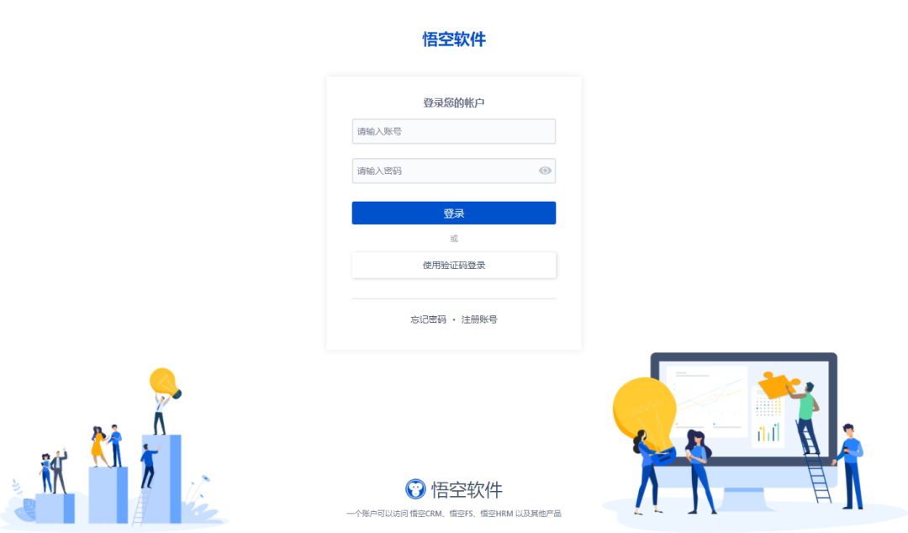
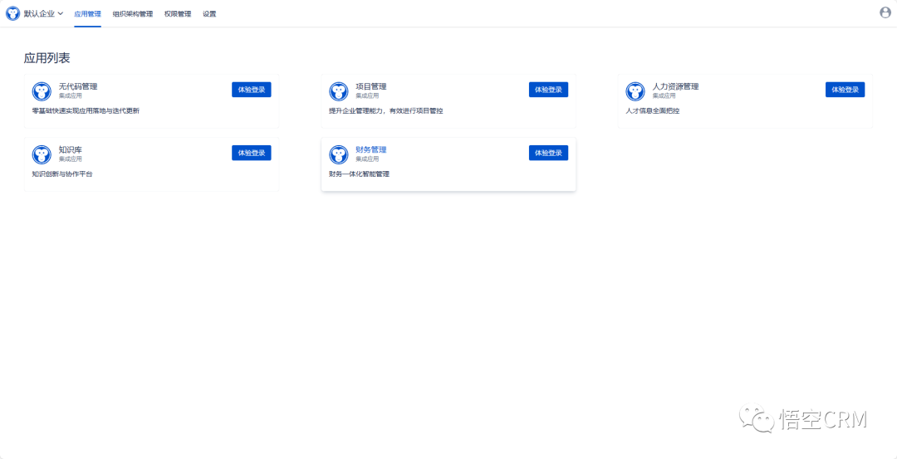
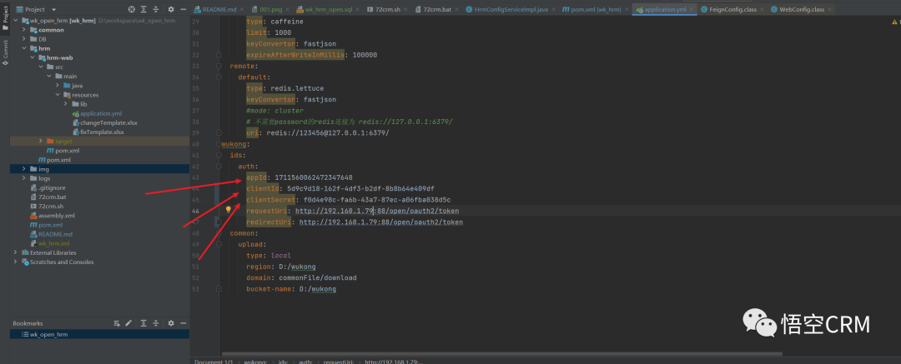
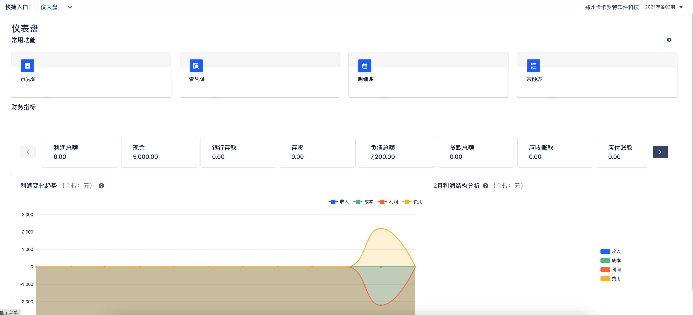
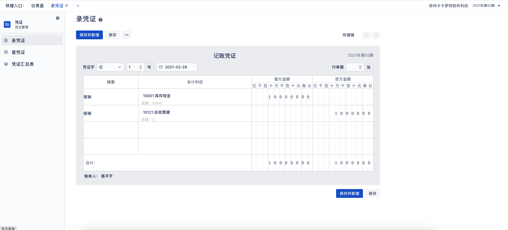
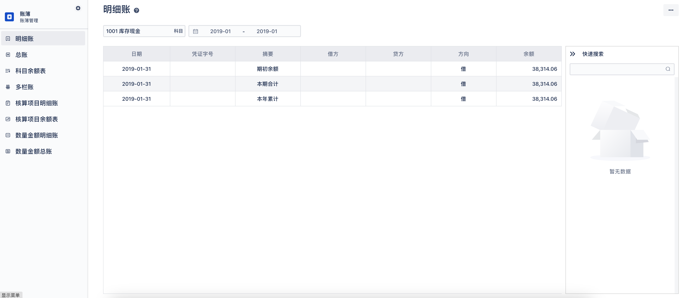
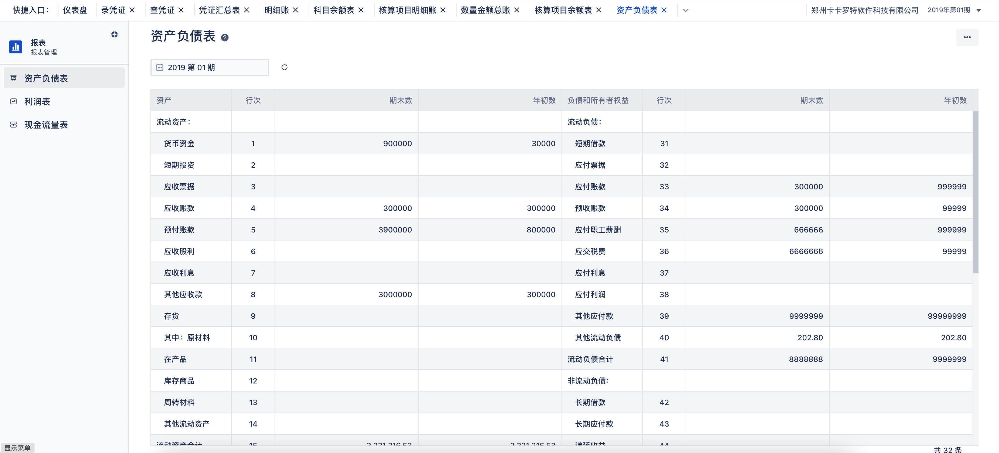
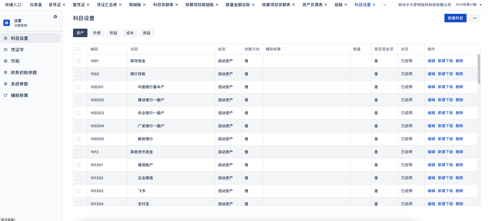
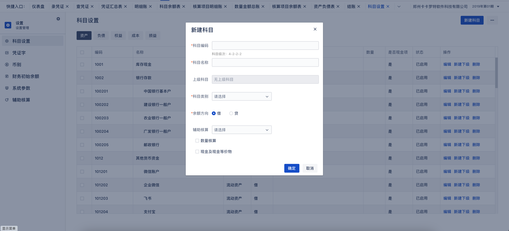

# Wukong Accounting

### 🌐Read This in [Chinese](README.md)

Demo Address: [https://www.72crm.com](http://www.72crm.com)

## Introduction to Wukong Financial System

Wukong Financial System is capable of satisfying the cross-level personnel of different roles to handle daily business. Through the system, users can prepare vouchers for receipts, payments, transfers, and handle period-end accounting and closing. The system automatically generates general ledgers, subsidiary ledgers, and financial statements, performs financial analysis, enhances the efficiency of corporate financial accounting, and reflects the business operating conditions.

Official Website Address: [http://www.5kcrm.com](http://www.5kcrm.com/)

Scan the QR code to add Wukong's official customer service WeChat, and you are invited to join the thousand-people WeChat discussion group:


Follow the Wukong CRM official WeChat account to learn more about Wukong's information


Scan the QR code to join the WeChat group and have online customer service answer your questions


:boom: :boom: :boom: Note: The Wukong Financial System adopts a new front-end and back-end separation mode. The code in this repository has integrated the front-end Vue packaged files, **so the packaging operation can be omitted without running the front end.**

# Wukong Project Management Directory Structure

```lua
wk_open_finance
├── common        -- Basic Module
├── DB        -- SQL files
├── finance        -- Financial Management Module
├── ux        -- Frontend Source Code
```

# Core Functional Modules

**Voucher Management, Intelligent Generation: Accurately and timely reflect the completion of various economic transactions on the basis of real and reliable voucher entries, providing a reliable basis for registering books.** <br/>
**Book Management, Multi-dimensional Query: Powerful ledger functionality allows you to quickly understand various financial indicators. Once vouchers are entered, you can query ledgers in multiple dimensions, supporting general ledger, subsidiary ledger, multi-column account, amount and quantity account, and accounting item category ledger queries.** <br/>
**Financial Statement Management, Providing a Basis for Business Adjustment: Ensuring high-quality financial information, clearly reflecting the financial situation of the enterprise, its asset operation ability, solvency, and profitability, providing a scientific basis for corporate strategic decision-making.** <br/>
**Auxiliary Accounting, Enhancing the Accuracy of Financial Business** <br/>
**Quick Closing, Improving Financial Work Efficiency: Calculate and record the total amount of transactions for the current period and the ending balance, and transfer the balance to the account specified in accordance with regulations, or carry it forward to the next accounting period, processing financial data accurately and efficiently.** <br/>
**Refined Subject Management, Systematically Understanding Economic Transactions** <br/>

# Main Technology Stack Used in Wukong Financial Management

# Backend:

| Name                  | Version               | Description |
|-----------------------|-----------------------|-------------|
| spring-cloud-alibaba  | 2021.0.5.0            | Core Framework |
| spring-boot           | 2.7.15                | Spring Version |
| mybatis-plus          | 3.5.3.2               | ORM Framework |

# Frontend:

| Technology | Description | Version |
|------------|-------------|---------|
| [Vue](https://vuejs.org) | Framework | 2.5.17 |
| [Vue-router](https://router.vuejs.org) | Routing Framework | 3.0.1 |
| [Vuex](https://vuex.vuejs.org) | Global State Management Framework | 3.0.1 |
| [Element](https://element.eleme.io) | UI Framework | 2.12.0 |
| [Axios](https://github.com/axios/axios) | HTTP Framework | 0.18.0 |

# Usage Instructions

### I. This project needs to be installed in a Linux environment, and you can install the Linux environment in a virtual machine.

The Linux environment configuration requirements are as follows:

Recommended Operating System: CentOS
System Memory: ≥16G
System CPU: ≥4 cores
Disk Size: ≥100G

### II. Prerequisite environment, the following configurations need to be installed in the Linux environment:

- Jdk1.8
- Maven3.5^
- Mysql8^
- Redis (version is not limited)
- Elasticsearch 8.5.3

### Installation Instructions

#### I. Dependency Environment Installation

###### 1. Install JDK

```
yum -y install java-1.8.0-openjdk-devel;
```

###### 2. Install Redis

```
yum -y install epel-release;
yum -y install redis;
systemctl start redis;

#-- Modify the Redis password to 123456
yum -y install vim;
vim /etc/redis.conf;

#-- Append a line at the bottom of the file
requirepass 123456
#-- Or search for # requirepass foobared using / and enter
#-- Delete the # in front, change foobared to 123456
#-- After modifying, save and exit with :wq, then restart Redis

systemctl restart redis;
```

###### 3. Install MySQL

```
wget https://repo.mysql.com//mysql80-community-release-el7-3.noarch.rpm
yum -y install mysql80-community-release-el7-3.noarch.rpm
yum -y install mysql-community-server --nogpgcheck
sudo systemctl start mysqld.service;
sudo systemctl enable mysqld.service;

#-- Check the default password of the installed MySQL
grep "password" /var/log/mysqld.log
#-- Enter MySQL, for example: mysql -u root -p"GXOO%eiI/7o>"
mysql -u root -p"your default password here"

#-- Change the MySQL password, as shown below
set global validate_password.policy=LOW;
ALTER USER 'root'@'localhost' IDENTIFIED BY 'new password';

#-- Exit MySQL
exit;

#-- Modify the MySQL configuration
vim /etc/my.cnf;
#-- Enter edit mode with i, modify the sql_mode setting, copy the sql_mode configuration below, and paste it under [mysqld] using shift+insert
sql_mode=STRICT_TRANS_TABLES,NO_ZERO_IN_DATE,NO_ZERO_DATE,ERROR_FOR_DIVISION_BY_ZERO,NO_ENGINE_SUBSTITUTION;
#-- After modifying, save and exit with :wq, then restart MySQL

service mysqld restart;
```

Certainly! Below is the translation of your text, formatted using Markdown:

```markdown
# Installation of Elasticsearch with the Following Configuration Information, Modify the Configuration Information

ingest.geoip.downloader.enabled: false  ## Add configuration
xpack.security.enabled: true
xpack.security.enrollment.enabled: true

xpack.security.http.ssl:
  enabled: false        # Change to false
  keystore.path: certs/http.p12

Enable encryption and mutual authentication between cluster nodes
xpack.security.transport.ssl:
  enabled: false         # Change to false
  verification_mode: certificate
  keystore.path: certs/transport.p12
  truststore.path: certs/transport.p12

-- Install Elasticsearch Analyzer
./elasticsearch-plugin install analysis-icu
-- Reset Elasticsearch Account Password
./elasticsearch-reset-password -u elastic

-- Start Elasticsearch from the bin directory
su elasticsearch
./elasticsearch
```

#### II. Project Configuration and Startup

yum -y install maven

###### 1. Import the Database Under the DB Directory

```
create database wk_open_finance character set utf8mb4 collate utf8mb4_general_ci;
 use wk_open_finance;
source XXX/wk_open_finance.sql (XXX is the project path)
```

###### 2. Execute mvn install in the Project Root Directory

###### 3. Modify the Following Configuration Information in the Project:

###### 3. In the finance module, configure the database username and password information, as well as the Redis account information in the resource directory.

###### 4. Visit [Wukong ID](https://id.72crm.com/) to Get an Account

###### After registration, click the default enterprise, and select Financial Management in the application list



###### Click Financial Management



##### Copy App ID, accessKey, and secretKey to finance-web\src\main\resources\application.yml, corresponding to appId, clientId, and clientSecret as shown below


Copy appId to finance-web\src\main\resources\static\APPLICATION_ID.txt, replacing the content inside

###### 5. Project Packaging and Deployment

```
-- Package the project
mkdir /opt/package
mvn clean -Dmaven.test.skip=true package
cp finance-web/target/finance-web.zip /opt/package
cd /opt/package
unzip finance-web.zip -d finance
cd finance
sh 72crm.sh start
```

###### 6. Run and Package the Frontend Project

```
- Download and install Node (LTS): https://nodejs.org/;
- This project is a front-end and back-end separation project. To access locally, you need to build a back-end environment. Please refer to [Back-end Project](https://gitee.com/wukongcrm/crm_pro);
- To access the online interface, there is no need to build a back-end environment. Just change the target in proxyTable under dev in config/index.js to the online address;
- Execute npm install to download the relevant dependencies;
- Execute npm run dev to run the project;
- If executed successfully, you can access http://localhost:8090 to view;

Packaging:
- Adjust the BASE_API in config/prod.env.js file to what you need
- Execute npm run build
- Packaging complete
```

### III. Other Instructions

#### 1. API Documentation<br/>

```
API documentation address: http://localhost:44316/doc.html
```

#### 2. Docker Image<br/>

```
Stay tuned
```

### IV. Preview of Wukong Financial Management Functional Modules







